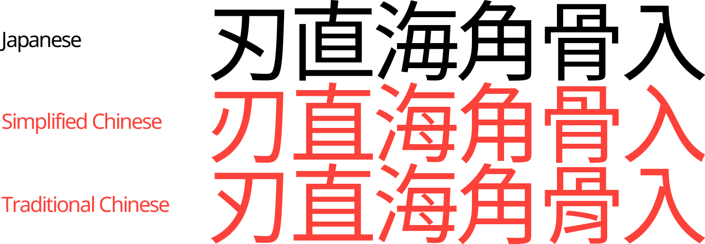

[Back to English](index.html)

## ここはどこ？

誰かがこのページを紹介してきたのであれば、その人は多分、あなたのコードの日本語の表示がおかしいと思っているのでしょう。英語で例えるならば、yѳur ҭєxҭ lѳѳκs κιnd ѳf lικє ҭЋιsといったように見えているはずです。

本ページは、アジア圏テキスト表示の実装でよく起こる文字表示の問題について、なぜそれが起こるのか、なぜそれが大きな問題なのか、そしてどのように修正すればいいか等の簡単な説明を提供します。

## ふむ、それで何が問題なの？

「漢字」は、中国が起源でありつつ、日本・韓国・台湾などでも使われている文字体系のことを指します。これらの国々での漢字の形は似ているものも多いですが、実は国ごとに微妙に形が違う字体もたくさんあります。（「字体」とはタイポグラフィにおける概念で、文字の意味や音ではなく姿形そのものを指す言葉です。）

たとえば、刃物のやいばを意味する文字の日本語と中国語（簡体・繁体）の字体を見てみましょう。

| 言語           | 字体                                | Unicodeコードポイント |
|----------------|-------------------------------------|---------------------|
| 日本語          |       | U+5203              |
| 簡体字中国語     |  | U+5203              |
| 繁体字中国語     |  | U+5203              |

日本語の文章が他言語の字体セットで表示されてしまうと、日本語ネイティブスピーカーの目には不自然で奇妙に映ります。この問題があなたのプログラムで起きているかもしれません。

## なぜこんなことに？

Unicodeの設計時、文字セットのサイズを小さく抑えるため、中国語・日本語・韓国語の漢字を「[CJK統合漢字](https://ja.wikipedia.org/wiki/CJK%E7%B5%B1%E5%90%88%E6%BC%A2%E5%AD%97)」としてまとめる決定がされました。このため「同じである」とみなされた別言語の漢字は、たとえ刃・刃・刃など字体が異なるものであっても、同一のコードポイント（符号位置）が割り当てられることがあるのです！実際、上の表の「刃」は全てU+5203が割り当てられています。正しい字体で表示するためには、プログラム側が適切なフォントを使って表示するよう対処する必要があります。

テキストの言語が不明な状況では、多くの場合、簡体字中国語の字体セットが自動的に選ばれます。したがって、開発者がこの問題の存在を認識していない場合、日本語のテキストが中国のグリフで表示される傾向があります。

## 本当に大した問題なの？今まで指摘された事なかったんだけど
この問題を今まで指摘された事がなかったのだとしたら、それはこの問題の影響を最も受ける層が非英語話者だからでしょう。

実際、この状態でアプリやウェブページが全く読めないというわけではないので、この問題を軽微なものとみなして優先度を下げたくなるかもしれません。しかし、この問題は、たとえば、オーバーハング付きの小文字のA(a)とオーバーハングなし(α)の違いよりも大きいものです。冒頭の例を思い出してください。もし英語で同等の問題が起きていたらιҭ wѳuld bє lѳѳκιng sѳmєҭЋιng lικє ҭЋιsのように見えるはずです。

上記の文が**明らかにおかしい**ものとして目に飛び込んでくるように、日本語ネイティブスピーカーにとって、見慣れた形と違う字体での漢字の表示は非常に気になるものです。これが放置されたままになっていると、その言語に対して無頓着に見える様子から、アプリやサイト自体の品質に疑問を持たれてしまう事もありえます。そのような印象を与えたくないのであれば、この問題の解決は必要です。

## では、どうすれば問題が起きているか確認できる？

以下に、各言語間で異なる字形を持つ漢字のサンプルを示します。

刃直海角骨入

このテキストをコピーして自分のアプリやページ内にペーストし、表示結果を下の図と比較してください。"Japanese"の表示サンプルと字形が異なっている場合（※明朝体・ゴシック体などフォント自体のスタイルの違いによる差は除く）、日本語の表示がおかしくなっています。

## 直し方は？

プログラムコードとフォントそれぞれが「日本語を表示している」と正しく認識させることで、問題を解決することができます。

In a nutshell, the way to fix it is to make your code and font be aware that it’s displaying Japanese when it is doing so. 

### Web開発: 要素を lang=ja としてマークする

ウェブブラウザーは普段、`font-family: sans-serif`などのフォント宣言に基づいて適切なフォントを自動で選びます。しかし、ブラウザーやOSの言語設定によっては、DOM要素の`lang`または`xml:lang`属性に`ja`と指定して「この文章は日本語である」と明示的に宣言していないと、適切なフォントが選ばれないことがあります。日本語のテキストを表示する場所では、そのDOM要素の`lang`属性が必ず`ja`になるようにしてください。

また、CSSでフォントを指定する際は、日本語表示に適したフォントを選んでください。以下は、多くのデバイスに最初から入っている日本語フォントを対象とした`font-family`の設定例です（[ICS Media](https://ics.media/entry/200317/)より許可のもと転載）：

    body {
      font-family: "Helvetica Neue",
        Arial,
        "Hiragino Kaku Gothic ProN",
        "Hiragino Sans",
        Meiryo,
        sans-serif;
    }

### ゲーム開発: 各言語専用のフォントアトラスを個別に作成する

ゲーム開発においては、フォントファイルからフォントのテクスチャアトラスを生成するシステムを使用して、フォントを格納・表示することがよくあります。例えば、Unityの[TextMesh Pro](https://docs.unity3d.com/Manual/com.unity.textmeshpro.html)など。

このようなシステムを使用している場合、アジアの各言語ごとに別々のフォントアトラスを生成して、使い分けるようにしてください。また、それらを生成するための元となるフォントがその言語専用に設計されていることを確認するのも重要です。[GoogleのNotoプロジェクト](https://fonts.google.com/noto)は、[日本語](https://fonts.google.com/noto/specimen/Noto+Sans+JP)、[簡体字中国語](https://fonts.google.com/noto/specimen/Noto+Sans+SC)、[繁体字中国語](https://fonts.google.com/noto/specimen/Noto+Sans+TC)、[韓国語](https://fonts.google.com/noto/specimen/Noto+Sans+KR)など、各言語専用に設計された高品質なオープンライセンスのフォントを提供しています。

## 他に何か注意するべき点は？

いくつかあります。 [別のページに分けました。](otherthings_ja.html)

## 他の言語でも似たような問題は？◯◯な環境での直し方は無いの？

私は日本語と英語しか話せず、個人的な問題意識からこのページを作ったので、申し訳ありませんが他の言語の状況はあまり把握していません。このサイトの情報に間違いや補足があれば、ぜひ教えてください。

## 参考資料

* Wikipedia: [CJK統合漢字](https://ja.wikipedia.org/wiki/CJK%E7%B5%B1%E5%90%88%E6%BC%A2%E5%AD%97), [Unihan](https://ja.wikipedia.org/wiki/Unihan)
* Model View Culture: [I Can Text You A Pile of Poo, But I Can’t Write My Name](https://modelviewculture.com/pieces/i-can-text-you-a-pile-of-poo-but-i-cant-write-my-name)

## 著者
井口健治
* [Email](mailto&#58;%&#54;Ee%65d&#108;&#101;&#64;&#104;eistak%2&#69;%63om), [Twitter](https://twitter.com/needle), [Facebook](http://heistak.com/fb)
