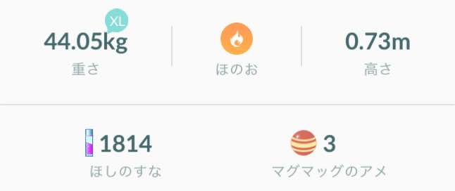

## Other things to be careful of

### Line breaking rules
Line breaking, or word-wrapping, in Japanese contain a few new rules as well. Web browsers and TextMesh Pro both have correct JP line breaking rules built in, but if you are rolling your own text display routines, you will also want to implement language-aware line breaking rules as well.

* The familiar western line-break rule of using spaces as opportunities to break into a new line should still be in effect.
* Points where the writing script switches between western and Asian, eg. "例えばこういっ**たe**xampl**eに**おいて" should also be used as opportunities to break as well, despite the lack of an explicit space character. 
* Certain characters like 。、） must not be the first character in a line, and should wrap at the character before it. For details, see [Wikipedia's article on Line breaking rules in East Asian languages](https://en.wikipedia.org/wiki/Line_breaking_rules_in_East_Asian_languages) *(Kinsoku Shori)*.

### Web: Do not enable discretionary ligatures
*Discretionary ligatures* is a feature of modern fonts, separate from normal ligatures, that allow certain character sequences to be rendered in a more decorative, ornamental style. Due to its often fanciful appearance, it is to be used with discretion, hence the name. Discretionary ligatures can be enabled in CSS as either `font-feature-settings: "dlig" 1` or `font-variant-ligatures: discretionary-ligatures`.

However, do *not* blanket-enable them in Japanese text! Doing so can inadvertently trigger all sorts of obscure weirdo ligatures such as the word マンション (mansion) turning into the single-letter ㍇ variant, ます (a very common way to end sentences in Japanese) turning into 〼, etc. There would be *very* few situations where you would want to intentionally trigger this. Please don't enable them.

### Use composite fonts

In cases where you generate font atlases, you may run into a situation where you are already using a specific font in the Western-text version of your game, and that font does not contain CJK glyphs. In such cases, you may want to go look for a font that does contain both Western and CJK glyphs, like the aforementioned Google Noto. 

When you do this, note that you do *not* need to switch your western glyphs into that CJK font just because you are using that font - in fact, please don't. It is normal, and even desired, for Asian graphic design in situations like this to use *composite fonts*, where one typeface is used for western text and another typeface for CJK text (preferably with matching font weights,) in order to retain the visual appearance of the original western-font-based design. Therefore, the best course of action would be to keep your western characters still sourced from your original font, but use a dedicated CJK font for CJK character code points. 

The above screenshot from Pokémon GO shows composite fonts in use. Note that the numbers and units are still displayed using [Lato](https://fonts.google.com/specimen/Lato), Pokémon GO's English font, while the Japanese text are displayed in Hiragino Kaku Gothic, a Japanese font built into iOS.

For web pages, if you specify the `font-family` with the western font first and Japanese font later, the rendering engine will use the western font for western glyphs, and use the Japanese font only for glyphs that are missing in the western font. This will successfully create a composite font appearance.

### Messaging Apps: Do not directly hook to the Enter key to submit messages

In messaging or chat apps, allowing the user to submit the message by hitting the Enter key is commonplace. While this is also great to have in Japanese environments as well, care is required on how exactly to implement this behavior.

In western languages, input from the keyboard is directly and immediately entered into text field. However, Japanese and several other languages use small programs called **input method editors (IMEs)** in order to input the vast number of possible characters using a standard keyboard. With text input using IMEs, characters entered from the keyboard is first brought to a intermediate buffer space where the user can convert the entered characters into the exact desired letter forms. Only when the user hits the Enter key are the text "finalized", leaves the buffer space, and into the text field. 

Hence, when using a messaging app, Japanese users (and other IME users) go through 4 steps: 

 1) Typing the raw keystrokes into the buffer space
 2) Converting those buffered text into desired letter forms and hitting Enter to finalize it
 3) Repeating steps 1 and 2 as necessary until the sentence is complete
 4) Finally, with nothing in the buffer, hitting Enter again to submit the message

The issue is that the *Enter key is used multiple times to interact with the IME program, without the intent of submitting the message.* If the messaging app is coded in a way that it directly hooks to the key code of the Enter key, the app will prematurely submit the message when the user is still in the middle of writing the message! To avoid this, the app should not look for the raw key code of the Enter key, but rather look for a newline character.

[Back to Main Page](index.html)
